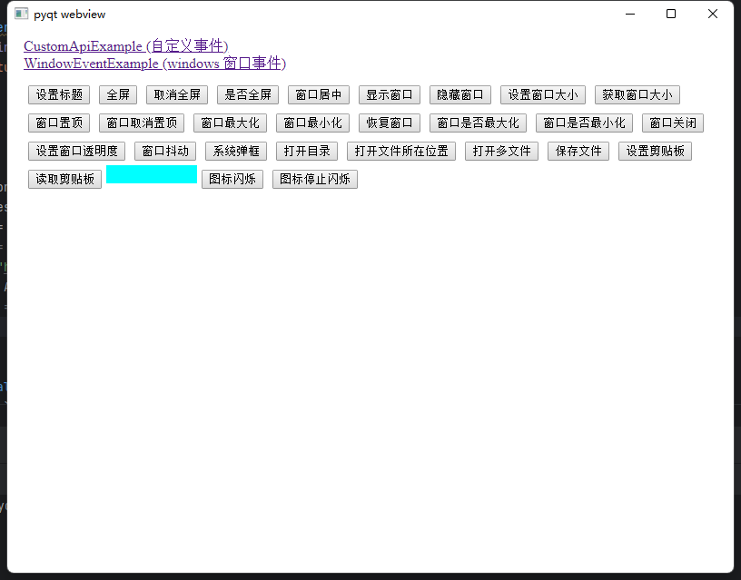

# pyqtweb
pyqtweb 是基于PyQt5的web引擎封装的webview组件，它可以让您使用您喜欢的前端语言开发漂亮的桌面应用。python绑定的方法在js中能使用Promise方式调用，js绑定的事件在python中也能触发。在win7系统中也能稳定运行(本人只测试了win7、win10、win11 以上版本，其他系统及版本未测试)。
###  功能截图



### 使用方式
使用前请先安装PyQt5和PyQtWebEngine
```shell
 pip install -r requirements.txt
```
示例
```python
import sys
from PyQt5.QtWidgets import QApplication
from pyqtweb import Options, BrowserWindow

if __name__ == '__main__':
    opt = Options()
    opt.title = "示例"
    opt.width = 800
    opt.height = 600
    opt.url = "http://localhost:5173/"
    app = QApplication(sys.argv)
    win = BrowserWindow(opt)
    win.show()
    sys.exit(app.exec_())
```
### 创建窗口选项 （Options）
- title：窗口标题
- width：窗口宽度
- height：窗口高度
- frameless：无边框窗口 
- bind：自定义暴露给前端的对象，前端可调用该对象的所有方法，且方法名，入参和定义相同
- url：前端url地址  若编译后请传入具体的 index.html路径
- debug：是否启用debug调试窗口
- inspector_port：调试端口 默认12580
- drag_selector ：可拖动class名称 默认 .pyqtweb-drag
- icon ：程序图标路径
- tray：系统托盘
### 创建托盘 （TrayOptions）
- icon：托盘图标
- actions：托盘菜单 TrayActionOptions
- trigger_func：点击托盘菜单回调
- tooltip：提示
- style：托盘样式 可自定义qss
#### 托盘菜单 （TrayActionOptions）
- key：点击时回调的值
- text：显示的文本
- icon：图标
- enable：是否可点击
- sub_actions：子菜单（TrayActionOptions） 只能两级
- TrayActionOptions.separator() 菜单分割线
### Api
js和python方法api名称相同，只是python在调用是需要 BrowserWindow 对象的 window_event_bind 属性
#### windows
- 设置标题：WindowSetTitle(title)  
- 全屏：WindowFullscreen(true)  
- 取消全屏: WindowFullscreen(false)  
- 是否全屏：WindowIsFullscreen()  
- 窗口居中：WindowCenter()  
- 显示窗口：WindowShow(true)  
- 隐藏窗口：WindowShow(false)  
- 设置窗口大小：WindowSetSize(width, height)  
- 获取窗口大小：WindowGetSize()  
- 窗口置顶：WindowSetStayOnTop(true)  
- 窗口取消置顶：WindowSetStayOnTop(false)  
- 窗口最大化：WindowMaximized()  
- 窗口最小化：WindowMinimized()  
- 恢复窗口：WindowRestore()  
- 窗口是否最大化：WindowIsMaximized()  
- 窗口是否最小化：WindowIsMinimized()  
- 窗口关闭：WindowClose()  
- 设置窗口透明度：WindowSetOpacity(level)  
- 窗口抖动：WindowShake()  
- 系统弹框：WindowMessageBox(type, title, text, yesText, cancelText)
- 可拖动区域: 默认 pyqtweb-drag 将这个class添加到可拖动组件上  
#### 文件对话框
- 打开目录:  OpenDirectoryDialog(title, dirName)
- 打开文件所在位置:  OpenFileDialog(title, dirName)
- 打开多文件:  OpenMultipleFilesDialog(title, dirName, filters) filters 是文件过滤多个用分号隔开 例如： *.txt;*.py;*.png
- 保存文件:  SaveFileDialog(title, dirName, filters)   
#### 剪贴板
- 设置剪贴板:   ClipboardSetText(text)
- 读取剪贴板:  ClipboardGetText()
#### 系统托盘
- 图标闪烁:  TrayStartFlash()
- 图标停止闪烁:  TrayStopFlash()  